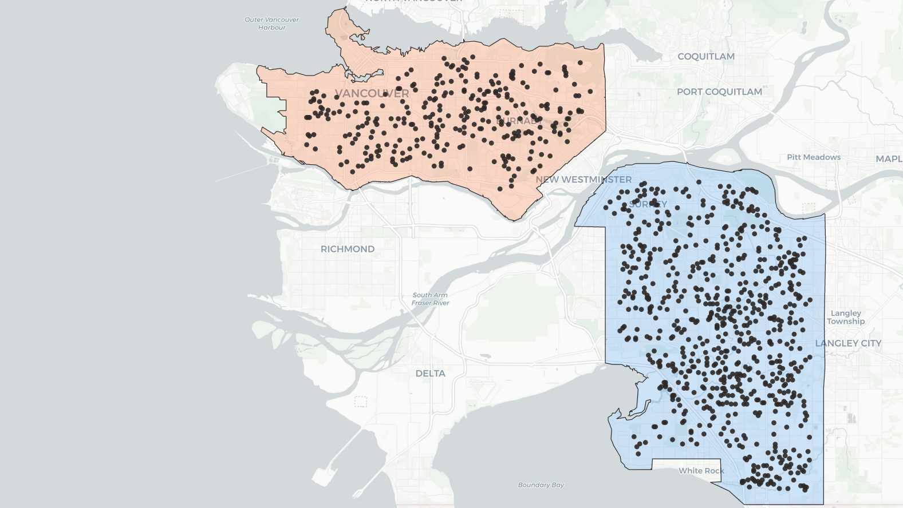
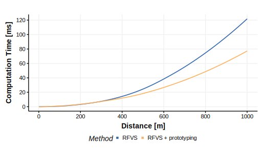

```{r setup, include=FALSE}
knitr::opts_chunk$set(echo = TRUE, message = FALSE, warning = FALSE, error = FALSE)
knitr::opts_knit$set(root.dir = "../../../")
```

## Libraries

```{r}
library(protoVS)
library(terra)
library(sf)
library(tidyverse)
```

We used a theme by [Koundinya Desiraju](https://rpubs.com/Koundy/71792) to visualise our results.

```{r echo=FALSE}
theme_Publication <- function(base_size=14, base_family="helvetica") {
  library(grid)
  library(ggthemes)
  (theme_foundation(base_size=base_size, base_family=base_family)
    + theme(plot.title = element_text(face = "bold",
                                      size = rel(1.2), hjust = 0.5),
            text = element_text(),
            panel.background = element_rect(colour = NA),
            plot.background = element_rect(colour = NA),
            panel.border = element_rect(colour = NA),
            axis.title = element_text(face = "bold",size = rel(1)),
            axis.title.y = element_text(angle=90,vjust =2),
            axis.title.x = element_text(vjust = -0.2),
            axis.text = element_text(), 
            axis.line = element_line(colour="black"),
            axis.ticks = element_line(),
            panel.grid.major = element_line(colour="#f0f0f0"),
            panel.grid.minor = element_blank(),
            legend.key = element_rect(colour = NA),
            legend.position = "bottom",
            legend.direction = "horizontal",
            legend.key.size= unit(0.2, "cm"),
            legend.margin = unit(0, "cm"),
            legend.title = element_text(face="italic"),
            plot.margin=unit(c(10,5,5,5),"mm"),
            strip.background=element_rect(colour="#f0f0f0",fill="#f0f0f0"),
            strip.text = element_text(face="bold")
    ))
  
}

scale_colour_Publication <- function(...){
  library(scales)
  discrete_scale("colour","Publication",manual_pal(values = c(
    "#386cb0", "#fdb462", "#7fc97f", "#ef3b2c", "#662506",
    "#a6cee3", "#fb9a99", "#984ea3", "#ffff33", "#ea7600"
  )), ...)
  
}

scale_fill_Publication <- function(...){
  library(scales)
  discrete_scale("fill","Publication",manual_pal(values = c(
    "#386cb0", "#fdb462", "#7fc97f", "#ef3b2c", "#662506",
    "#a6cee3", "#fb9a99", "#984ea3", "#ffff33", "#ea7600"
  )), ...)
}
```

## Elevation Data and Observer Locations

For the viewshed experiment we used LiDAR derived a Digital Surface Model (DSM) and Digital Terrain Model (DTM) with 1m spatial resolution of the Vancouver metropolitan area [@NaturalResourcesCanada.2019].

```{r eval=FALSE}
DTM <- rast("data/DTM_Vancouver_1m.tif")
DSM <- rast("data/DSM_Vancouver_1m.tif")
```

We'll calculate viewsheds at random observer locations across the complete study area. To avoid edge effects we'll apply a negativ buffer of 1000 m to the area of interest (AOI) shapefile.

```{r eval=FALSE}
# Read shapefile and apply negative buffer
aoi <- read_sf("data/Vancouver.gpkg") %>% 
  st_buffer(-1000)

# Points every 100 m
aoi_grid_100 <- sf::st_make_grid(aoi, 100, what = "centers")
aoi_grid_100 <- aoi_grid_100[aoi]

# Extract observer height (DTM + 1.7m) and height of DSM
h_dtm <- terra::extract(DTM, st_coordinates(aoi_grid_100)) + 1.7
h_dsm <- terra::extract(DSM, st_coordinates(aoi_grid_100))

# Heigth at observer location should be smaller than height of DSM
# which would be the case if observer was inside a house, underneath a tree etc.
# In this case, the algorithm would have lower computation time
set.seed(1234)
observer <- aoi_grid_100[which(h_dtm > h_dsm)] %>% 
  sf::st_sample(1000) %>% 
  sf::st_cast("POINT") %>% 
  sf::st_as_sf(crs = st_crs(aoi)) %>% 
  dplyr::rename(geom = x)
```
<div style="position: relative; padding-bottom: 56.25%; height: 0; overflow: hidden;">
  <a href="https://h2961284.stratoserver.net/AGILE/viewshed_observer_locations.html">
     
  </a>
</div>

## Viewshed calculation
Viewsheds for all points have been calculated at multiple distance levels from 1 to 1000 m. We measured total runtime for each distance level and scaled it to computation time per viewshed. The times represent the average of 20 runs and are given in milliseconds.

```{r eval=FALSE}
max_distance_vec <- c(
  1:4, seq(5, 20, 5), 25, seq(50, 1000, 50)
)

vs_time <- viewshed_comparison(observer = observer,
                               dsm_rast = DSM, dtm_rast = DTM,
                               max_distance_vec = max_distance_vec,
                               observer_height = 1.7, sample_size = 10,
                               ncores = 10, progress = TRUE)

```

## Results
<div style="position: relative; padding-bottom: 56.25%; height: 0; overflow: hidden;">
  <a href="https://h2961284.stratoserver.net/AGILE/viewshed_computation_time_small.html">
     
  </a>
</div>

```{r echo=FALSE, fig.height=10, fig.width=14, eval=FALSE}
vs_time <- read_csv("docs/workflows/04_1_Experiment_Viewshed/viewshed_computation_time.csv")

vs_plot <- vs_time %>%
  mutate(d = if_else(distance < 300, 1, 2)) %>% 
  mutate(method = as_factor(method)) %>% 
  ggplot(aes(x = distance, y = time_mean, colour = method)) + 
  #geom_line(size = 1.2) +
  geom_smooth(size = 0.8, se = F) +
  scale_y_continuous(breaks = scales::pretty_breaks()) +
  scale_x_continuous(breaks = scales::pretty_breaks()) +
  labs(x = "Distance [m]", y = "Computation Time [ms]", colour = "Method") +
  scale_colour_Publication() +
  theme_Publication() +
  guides(color = guide_legend(override.aes = list(size = 2))) +
  facet_wrap(~d, scales = "free") + 
  theme(
    strip.background = element_blank(),
    strip.text.x = element_blank()
  )
vs_plot
#ggsave(filename = "docs/computation_time.png", plot = vs_plot, device = "png",
#       height = 4, width = 7.5, units = "in", dpi = 300)
#ggsave(filename = "docs/computation_time.svg", plot = vs_plot, device = "svg",
#       height = 4, width = 7.5, units = "in", dpi = 300)
```

### Novel vs. Old Algorithm - Level of Improvement

```{r echo=FALSE, dev='svg'}
vs_time <- read_csv("docs/workflows/04_1_Experiment_Viewshed/viewshed_computation_time.csv")
p <- tibble(
  distance = as.numeric(),
  prop = as.numeric()
)

# Levels below 20m distance had very hight performance compared to the old algorithm.
# It looked like outliers to us, therefore these values have been removed.
for(d in unique(vs_time$distance[vs_time$distance > 20])){
  time_old <- vs_time[vs_time$distance == d & vs_time$method == "Old", ]$time_mean
  time_new <- vs_time[vs_time$distance == d & vs_time$method == "New", ]$time_mean
  
  p <- p %>% 
    add_row(tibble(
      distance = d,
      prop = time_old / time_new
    ))
}

specify_decimal <- function(x, k) trimws(format(round(x, k), nsmall=k))

p_mean_overall <- specify_decimal(mean(p$prop-1)*100, 1)
p_sd_overall <- specify_decimal(sd(p$prop-1)*100, 1)

p_mean_low <- specify_decimal(mean(p[p$distance < 300, ]$prop-1)*100, 1)
p_sd_low <- specify_decimal(sd(p[p$distance < 300, ]$prop-1)*100, 1)

p_mean_high <- specify_decimal(mean(p[p$distance >= 300, ]$prop-1)*100, 1)
p_sd_high <- specify_decimal(sd(p[p$distance >= 300, ]$prop-1)*100, 1)


p %>% 
  ggplot(aes(x = distance, y = prop-1)) + 
  geom_line(size = 1.2) +
  theme_Publication() +
  scale_y_continuous(labels = scales::percent) +
  labs(x = "Distance [m]", y = "Improvement")
```

At \~250 our novel algorithm has similar (but not lower), otherwise better performance compared to the old algortihm. Overall, mean single-core computation time per viewshed was improved by `r p_mean_overall`% (±`r p_sd_overall`%) using our novel algorithm. Smaller improvements of `r p_mean_low`% (±`r p_sd_low`%) were measured for small viewsheds (r \< 300 m), using a larger radius (r \>= 300 m) led to an improvement of `r p_mean_high`% (±`r p_sd_high`%).

## Bibliography
