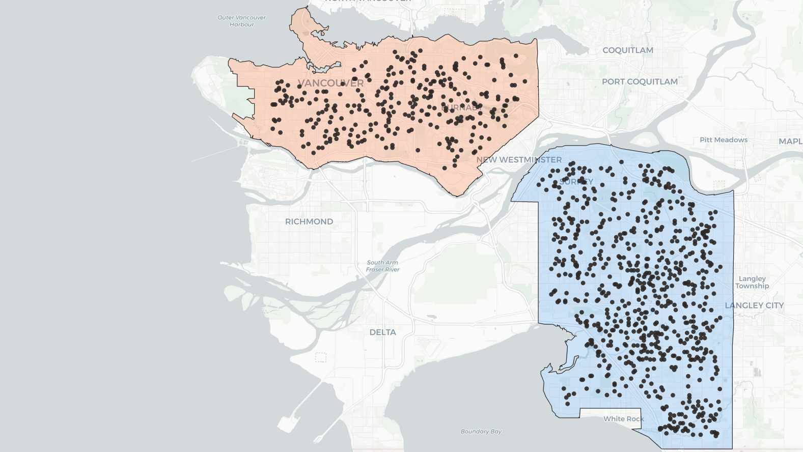
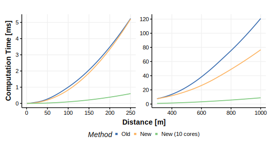
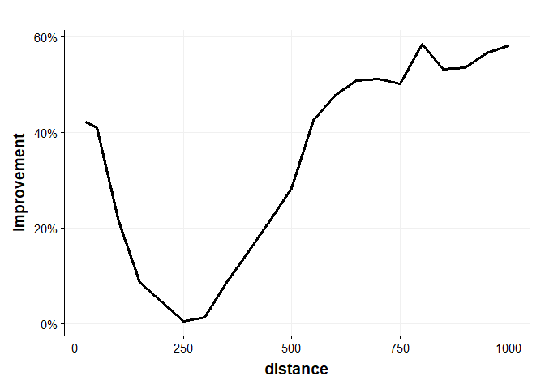

Experiment - Viewshed
================
Sebastian Brinkmann
31 3 2022

## Libraries

``` r
library(protoVS)
library(terra)
library(sf)
library(tidyverse)
```

We used a theme by [Koundinya Desiraju](https://rpubs.com/Koundy/71792)
to visualise our results.

## Elevation Data and Observer Locations

For the viewshed experiment we used LiDAR derived a Digital Surface
Model (DSM) and Digital Terrain Model (DTM) with 1m spatial resolution
of the Vancouver metropolitan area (Natural Resources Canada 2019).

``` r
DTM <- rast("data/DTM_Vancouver_1m.tif")
DSM <- rast("data/DSM_Vancouver_1m.tif")
```

We’ll calculate viewsheds at random observer locations across the
complete study area. To avoid edge effects we’ll apply a negativ buffer
of 1000 m to the area of interest (AOI) shapefile.

``` r
# Read shapefile and apply negative buffer
aoi <- read_sf("data/Vancouver.gpkg") %>% 
  st_buffer(-1000)

# Points every 100 m
aoi_grid_100 <- sf::st_make_grid(aoi, 100, what = "centers")
aoi_grid_100 <- aoi_grid_100[aoi]

# Extract observer height (DTM + 1.7m) and height of DSM
h_dtm <- terra::extract(DTM, st_coordinates(aoi_grid_100)) + 1.7
h_dsm <- terra::extract(DSM, st_coordinates(aoi_grid_100))

# Heigth at observer location should be smaller than height of DSM
# which would be the case if observer was inside a house, underneath a tree etc.
# In this case, the algorithm would have lower computation time
set.seed(1234)
observer <- aoi_grid_100[which(h_dtm > h_dsm)] %>% 
  sf::st_sample(1000) %>% 
  sf::st_cast("POINT") %>% 
  sf::st_as_sf(crs = st_crs(aoi)) %>% 
  dplyr::rename(geom = x)
```

<div
style="position: relative; padding-bottom: 56.25%; height: 0; overflow: hidden;">

<a href="https://h2961284.stratoserver.net/AGILE/viewshed_observer_locations.html">

</a>

</div>

## Viewshed calculation

Viewsheds for all points have been calculated at multiple distance
levels from 1 to 1000 m. We measured total runtime for each distance
level and scaled it to computation time per viewshed. The times
represent the average of 20 runs and are given in milliseconds.

``` r
max_distance_vec <- c(
  1:4, seq(5, 20, 5), 25, seq(50, 1000, 50)
)

vs_time <- viewshed_comparison(observer = observer,
                               dsm_rast = DSM, dtm_rast = DTM,
                               max_distance_vec = max_distance_vec,
                               observer_height = 1.7, sample_size = 10,
                               ncores = 10, progress = TRUE)
```

## Results

<div
style="position: relative; padding-bottom: 56.25%; height: 0; overflow: hidden;">

<a href="https://h2961284.stratoserver.net/AGILE/viewshed_computation_time_small.html">

</a>

</div>

### Novel vs. Old Algorithm - Level of Improvement

<!-- -->

At \~250 our novel algorithm has similar (but not lower), otherwise
better performance compared to the old algortihm. Overall, mean
single-core computation time per viewshed was improved by 34.2% (±20.9%)
using our novel algorithm. Smaller improvements of 19.8% (±18.4%) were
measured for small viewsheds (r &lt; 300 m), using a larger radius (r
&gt;= 300 m) led to an improvement of 39.9% (±19.4%).

## Bibliography

<div id="refs" class="references csl-bib-body hanging-indent">

<div id="ref-NaturalResourcesCanada.2019" class="csl-entry">

Natural Resources Canada. 2019. “High Resolution Digital Elevation Model
(HRDEM) - CanElevation Serie.”
<https://open.canada.ca/data/en/dataset/957782bf-847c-4644-a757-e383c0057995>.

</div>

</div>
